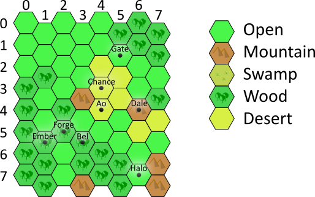
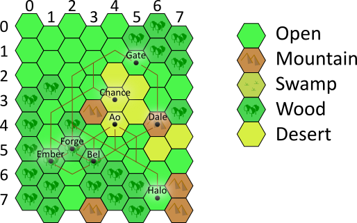

### Demo:
https://izharfine.github.io/EzMapSolver/

```
You have a map of hexagonal tiles. Each tile has coordinates (column, row).
For example: 



Each tile has a terrain type. There are five different types of terrain:
 mountain, wood, open, swamp, and desert. On some tiles there are cities.
The cities in the map above are on tiles: Ao (4,4), Bel (3,5), Chance (4,3),
 Dale (6,4), Ember (1,5), Forge (2,5), Gate (5,1), Halo (6,7)
 
 A city has resources. There are six types of resources: produce, wood,
  stone, clay, ore, and textile. Each city is missing some resource or
  resources.
 
 In this example:
 * Ao has stone
 * Bel has produce and stone
 * Chance has textile and clay
 * Dale has wood and clay
 * Ember has ore, textile and clay
 * Forge has ore and stone
 * Gate has ore
 * Halo has produce and ore
 
 Each terrain type has a movement cost:
 * Mountain = 6
 * Wood = 2
 * Open = 1
 * Swamp = 4
 * Desert = 7
 
 The cost of the road from tile A to tile B is the sum of the cost of all tiles
 in the road except tile A.
 
 Your job is to find the roads for all the cities, that  will enable each city
 access to all the resources with the minimal movement cost (for each city, separately).
 
 Here is the solution for the map above: 
 
 
 
 The input is a description of a map comprised of two parts:
 1. The terrain: a list of columns (one per line), each column a list of tiles
 (with terrain type for the tile)
 2. A list of cities (one per line, each line has the the city coordinates and the
 resources it has)
 
 Example input (same as the map above):
 
 [open, open, open, wood, wood, wood, wood, wood],
 [open, open, wood, open, open, wood, wood, wood],
 [open, open, open, open, wood, wood, open, open],
 [open, open, open, mountain, open, wood, wood, mountain],
 [open, open, desert, desert, desert, open, wood, wood],
 [wood, open, desert, desert, open, open, wood, wood],
 [wood, wood, open, open, mountain, desert, open, open],
 [wood, wood, open, wood, desert, open, mountain, mountain],

 Cities:
 
	(4, 4), Stone
	(3, 5), Produce, Stone
	(4, 3), Textile, Clay
	(6, 4), Wood, Clay
	(1, 5), Ore, Textile, Clay
	(2, 5), Ore, Stone
	(5, 1), Ore
	(6, 7), Produce, Ore

The solution should be a text describing the roads, one line per road (each line
 '\n' terminated). A road is a list of tiles (the coordinates of the tiles in
 parenthesis, separated by comma). Each road must start with a tile with a city
 and end with a tile with a city.

For example (part of the solution to the example):

(6, 7), (6, 6), (5, 5), (4, 5), (3, 5)
(6, 7), (6, 6), (5, 5), (4, 5), (3, 4), (2, 5), (1, 5)
(6, 7), (6, 6), (5, 5), (5, 4), (6, 4)
...


The input is at http://3.122.27.254/map
Post your solution at http://3.122.27.254/solution

P.S.
This file is in Markdown, do not incude <br> in your soltuion.
```
